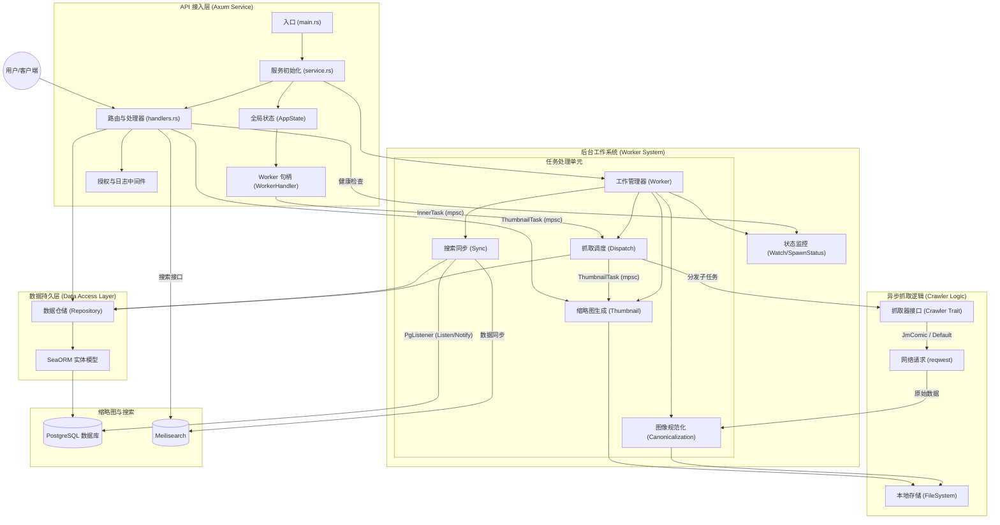

```mermaid
graph TD
    subgraph "API 接入层 (Axum Service)"
        Main["入口 (main.rs)"] --> Service["服务初始化 (service.rs)"]
        Service --> State["全局状态 (AppState)"]
        State --> Handler["Worker 句柄 (WorkerHandler)"]
        Service --> Router["路由与处理器 (handlers.rs)"]
        Router --> Middleware["授权与日志中间件"]
    end

    subgraph "后台工作系统 (Worker System)"
        Service --> Worker["工作管理器 (Worker)"]
        Worker --> Watch["状态监控 (Watch/SpawnStatus)"]
        
        subgraph "任务处理单元"
            Worker --> Dispatch["抓取调度 (Dispatch)"]
            Worker --> Thumbnail["缩略图生成 (Thumbnail)"]
            Worker --> Sync["搜索同步 (Sync)"]
            Worker --> Canonical["图像规范化 (Canonicalization)"]
        end
    end

    subgraph "异步抓取逻辑 (Crawler Logic)"
        Handler -- "InnerTask (mpsc)" --> Dispatch
        Dispatch -- "分发子任务" --> CrawlerTrait["抓取器接口 (Crawler Trait)"]
        CrawlerTrait -- "JmComic / Default" --> Net["网络请求 (reqwest)"]
        Net -- "原始数据" --> Canonical
        Canonical --> Storage["本地存储 (FileSystem)"]
    end

    subgraph "缩略图与搜索"
        Dispatch -- "ThumbnailTask (mpsc)" --> Thumbnail
        Router -- "ThumbnailTask (mpsc)" --> Thumbnail
        Thumbnail --> Storage
        
        Sync -- "PgListener (Listen/Notify)" --> DB
        Sync -- "数据同步" --> Meili[("Meilisearch")]
        Router -- "搜索接口" --> Meili
    end

    subgraph "数据持久层 (Data Access Layer)"
        Repo["数据仓储 (Repository)"]
        Repo --> ORM["SeaORM 实体模型"]
        ORM --> DB[("PostgreSQL 数据库")]
    end

    User((用户/客户端)) --> Router
    Router -- "健康检查" --> Watch
    Router --> Repo
    Dispatch --> Repo
    Sync --> Repo
```

### 监控与运维 (Monitoring & Ops)
- [ ] **日志审计**: 增加关键操作的日志记录与异常告警。

### 前端展示 (Frontend)
- [ ] **Web 客户端**: 开发一套现代化的 Web UI，用于管理任务、浏览书架及在线阅读。
- [ ] **移动端支持**: 适配移动端浏览器或开发原生应用。