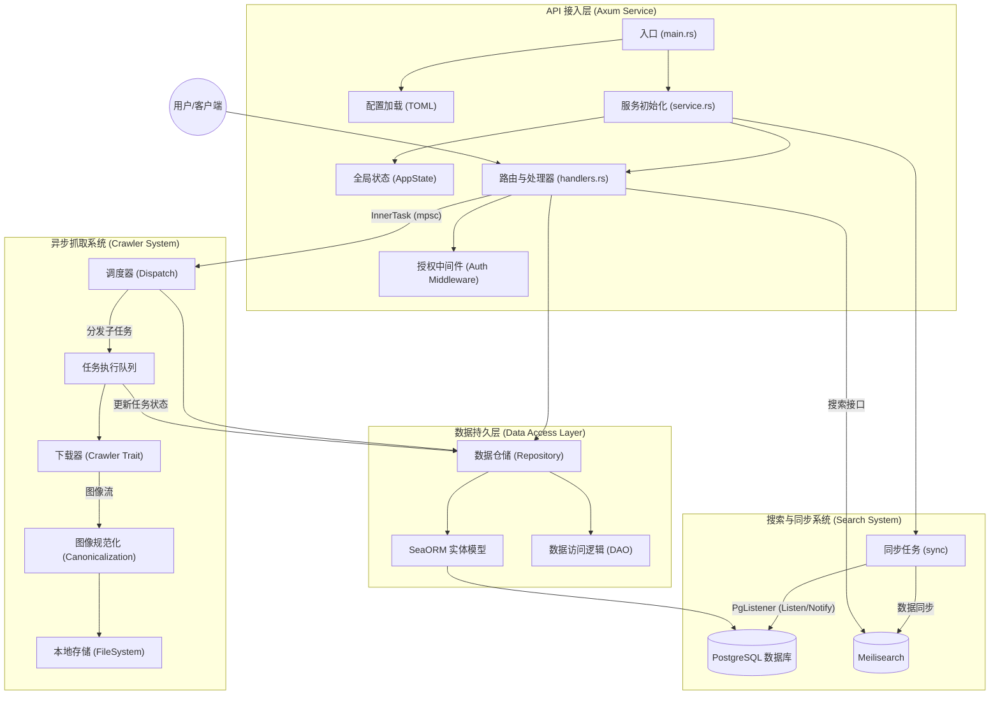

```mermaid
graph TD
    subgraph "API 接入层 (Axum Service)"
        Main["入口 (main.rs)"] --> Config["配置加载 (TOML)"]
        Main --> Service["服务初始化 (service.rs)"]
        Service --> State["全局状态 (AppState)"]
        Service --> Router["路由与处理器 (handlers.rs)"]
        Router --> Middleware["授权中间件 (Auth Middleware)"]
    end

    subgraph "异步抓取系统 (Crawler System)"
        Router -- "InnerTask (mpsc)" --> Dispatch["调度器 (Dispatch)"]
        Dispatch -- "分发子任务" --> TaskQueue["任务执行队列"]
        TaskQueue --> Downloader["下载器 (Crawler Trait)"]
        Downloader -- "图像流" --> Canonical["图像规范化 (Canonicalization)"]
        Canonical --> Storage["本地存储 (FileSystem)"]
    end

    subgraph "搜索与同步系统 (Search System)"
        Service --> Sync["同步任务 (sync)"]
        Sync -- "PgListener (Listen/Notify)" --> DB
        Sync -- "数据同步" --> Meili[("Meilisearch")]
        Router -- "搜索接口" --> Meili
    end

    subgraph "数据持久层 (Data Access Layer)"
        Repo["数据仓储 (Repository)"]
        Repo --> ORM["SeaORM 实体模型"]
        ORM --> DB[("PostgreSQL 数据库")]
        Repo --> DAO["数据访问逻辑 (DAO)"]
    end

    User((用户/客户端)) --> Router
    Router --> Repo
    Dispatch --> Repo
    TaskQueue -- "更新任务状态" --> Repo
```

### 监控与运维 (Monit$$oring & Ops)
- [ ] **日志审计**: 增加关键操作的日志记录与异常告警。

### 前端展示 (Frontend)
- [ ] **Web 客户端**: 开发一套现代化的 Web UI，用于管理任务、浏览书架及在线阅读。
- [ ] **移动端支持**: 适配移动端浏览器或开发原生应用。