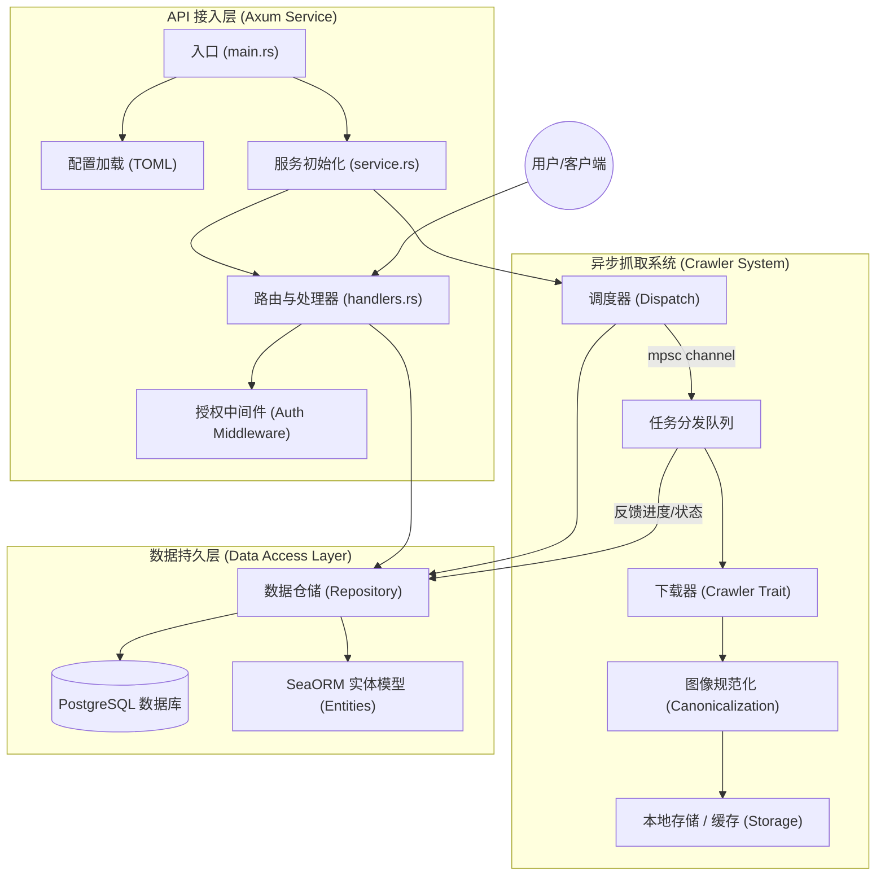

```mermaid
graph TD
    subgraph "API 接入层 (Axum Service)"
        Main["入口 (main.rs)"] --> Config["配置加载 (TOML)"]
        Main --> Service["服务初始化 (service.rs)"]
        Service --> Router["路由与处理器 (handlers.rs)"]
        Router --> Middleware["授权中间件 (Auth Middleware)"]
    end

    subgraph "异步抓取系统 (Crawler System)"
        Service --> Dispatch["调度器 (Dispatch)"]
        Dispatch -- "mpsc channel" --> TaskQueue["任务分发队列"]
        TaskQueue --> Downloader["下载器 (Crawler Trait)"]
        Downloader --> Canonical["图像规范化 (Canonicalization)"]
        Canonical --> Storage["本地存储 / 缓存 (Storage)"]
    end

    subgraph "数据持久层 (Data Access Layer)"
        Router --> Repo["数据仓储 (Repository)"]
        Dispatch --> Repo
        Repo --> DB[("PostgreSQL 数据库")]
        Repo --> ORM["SeaORM 实体模型 (Entities)"]
    end

    User((用户/客户端)) --> Router
    TaskQueue -- "反馈进度/状态" --> Repo
```