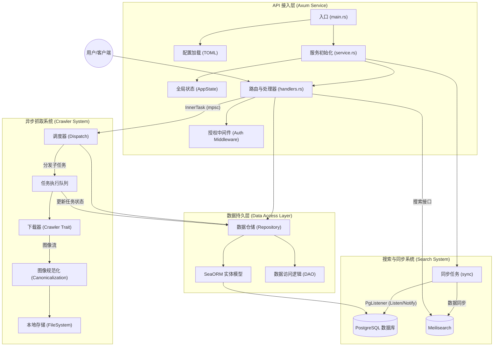

## TODO List

### 核心功能与抓取系统 (Core & Crawler)
- [ ] **站点适配器 (Scrapers)**: 实现针对主流漫画网站（如 MangaDex, NHentai 等）的特定抓取逻辑，目前仅支持通用文件下载。
- [ ] **智能抓取**: 支持通过漫画详情页 URL 直接解析并抓取，无需手动输入所有图片链接。
- [ ] **自动更新**: 定时检查已收藏漫画的新章节并自动触发下载任务。
- [ ] **代理与限流**: 引入代理池支持与请求频率限制，防止在抓取过程中被目标网站封禁。

### 用户与鉴权系统 (User & Auth)
- [ ] **用户管理**: 实现完整的用户注册、登录及权限管理功能。
- [ ] **Token 维护**: 提供生成、刷新及撤销访问 Token 的 API 接口。
- [ ] **多用户支持**: 实现数据隔离，支持个人收藏夹、阅读进度同步等功能。

### 元数据与搜索 (Metadata & Search)
- [ ] **外部元数据集成**: 对接 AniList、MyAnimeList 等第三方平台，自动补全漫画详情（作者、评分、连载状态等）。
- [ ] **高级搜索**: 在 Meilisearch 基础上支持更复杂的聚合搜索与过滤条件。

### 图像处理与导出 (Processing & Export)
- [ ] **多样化导出**: 支持将下载的漫画导出为 CBZ、PDF 或 EPUB 等常用格式。
- [ ] **增强规范化**: 提供图像缩放、质量优化及格式转换（如转为更小的 AVIF）的更多配置项。

### 监控与运维 (Monit$$oring & Ops)
- [ ] **任务监控详情**: 提供更细粒度的任务进度接口，支持查看子任务的具体状态。
- [ ] **在线配置**: 支持通过 API 动态修改服务配置，而不仅限于本地 TOML 文件。
- [ ] **日志审计**: 增加关键操作的日志记录与异常告警。

### 前端展示 (Frontend)
- [ ] **Web 客户端**: 开发一套现代化的 Web UI，用于管理任务、浏览书架及在线阅读。
- [ ] **移动端支持**: 适配移动端浏览器或开发原生应用。